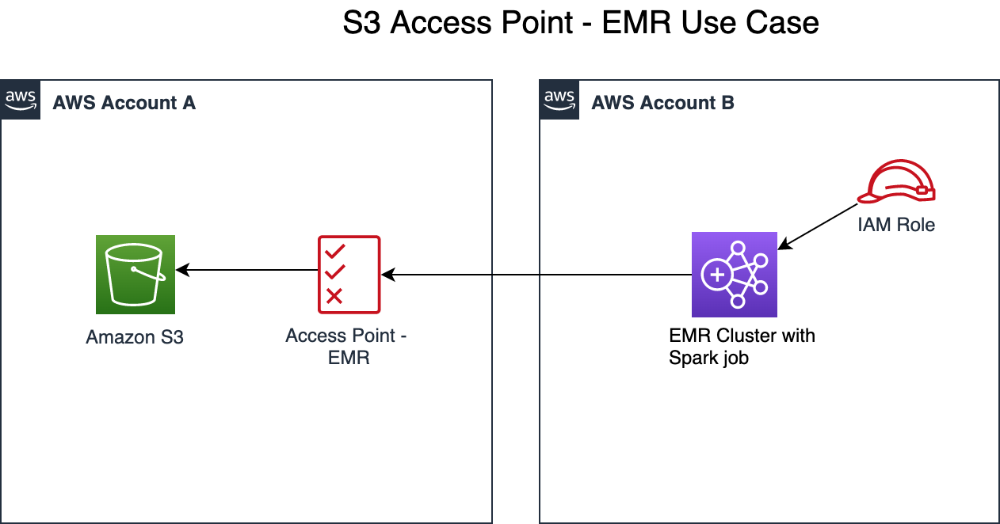

# Amazon S3 access points for cross-account integration - EMR use case

This is a sample solution to demonstrate S3 cross-account access from EMR using [Access points](https://docs.aws.amazon.com/AmazonS3/latest/dev/access-points.html). 

Figure below represents the architecture of the solution.



---

## AWS Service Requirements

The following AWS services are required to test this solution.

### Source Account

1. One Amazon S3 bucket
1. One bucket policy
1. One Access Point
1. One KMS Key to encrypt S3 bucket

---

### Target Account

1. One S3 Bucket
1. One IAM Role
1. One EMR Cluster

---

## Source Code Overview

| Code | Overview|
|-------------------------------------------------------------- | -------------- |
| [spark_on_emr_s3_access_points.py](./src/spark_on_emr_s3_access_points.py) | PySpark script to read and write data using S3 Access Points.|

---

## Deployment Instructions - Account A (E.g. 2345678901)

1. Login to AWS Management Console
1. Go to KMS and create a Customer managed key
   - For Key administrators, add required users / roles in Account A
   - For Key users, add
      - required users / roles in Account A
      - under ```Other AWS accounts```, add id for Account B e.g. ```arn:aws:iam::1234567890:root```
1. Go to S3 and create a bucket. Copy sample CSV data to this bucket. e.g. [NYC taxi data](https://registry.opendata.aws/nyc-tlc-trip-records-pds/)
1. Go to Properties, under Default encryption, select AWS-KMS and select the KMS key created in the previous step
1. Create a bucket policy using sample [bucket_policy_delegate_permissions_to_access_point_sample](./resources/bucket_policy_delegate_permissions_to_access_point_sample.json)
1. Create access point using sample   [access_point_for_emr_role_sample](./resources/access_point_policy_for_emr_role_sample.json)


---

## Deployment Instructions - Account B (E.g. 1234567890)

1. Go to S3 and create a bucket to store PySpark script and EMR logs
1. Go to EMR and click on `Create Cluster`
1. Under General Configuration, provide Name, S3 folder for logging and select `Cluster` as Launch mode
1. Under Software Configuration, select `emr-5.XX.X` as Release and `Spark` as Application
1. Under Hardware Configuration, select `m5.xlarge` as Instance type and `3` as number of instances
1. Under Security and access, create and select EC2 key pair, and permissions as default. For roles, select `EMR_DefaultRole` as EMR role and `EMR_EC2_DefaultRole` as EC2 instance profile
1. Click on "Create Cluster"
1. Once the EMR cluster is up and running, go to IAM and select `EMR_EC2_DefaultRole`
1. Attach two more policies to this role:
   - IAM Policy for KMS. Use [kms_policy_emr_sample](./resources/kms_policy_emr_sample.json) as a sample
   - IAM Policy for S3. Use [s3_policy_emr_sample](./resources/s3_policy_emr_sample.json) as a sample

---

## Testing Instructions - Account B

Follow below instructions to execute a PySpark job in EMR:

1. Upload the source code `s3_access_points.py` to S3 bucket created in Account B
1. Go to EMR console and select the cluster created in the previous step
1. Navigate to `Steps` tab and click `Add step`
1. Select `Spark Application` as Step type and provide a Name
1. Select `Cluster` as Deploy mode, S3 path for source code `s3_access_points.py` as Application location
1. Under Arguments provide the following:
   - --input_uri s3://arn:aws:s3::Account_A:accesspoint/a-emr-access-point/SAMPLE_CSV_FILE
   - --output_uri s3://arn:aws:s3::Account_A:accesspoint/a-emr-access-point/output
1. Select `Continue` as Action on failure and then click `Add`
1. This kick starts the Spark job. You can monitor the logs under Cluster > Application user interfaces > Spark history server
1. Once done, the step changes from `Pending` to `Completed` state
1. Verify the output folder of S3 bucket in Account_A to make sure the data is saved

---

## Cleaning up

After the testing is complete, you may terminate the cluster using the following steps,
1. Navigate to EMR console and select the cluster to terminate
1. Choose Terminate. When prompted, choose Change to turn termination protection off
1. In the Terminate clusters dialog, for Termination Protection, choose Off and then click the check mark to confirm
1. Click Terminate

Also delete other resources created as part of this sample when not in use.

---

## License Summary

This sample code is made available under the MIT license. See the LICENSE file.