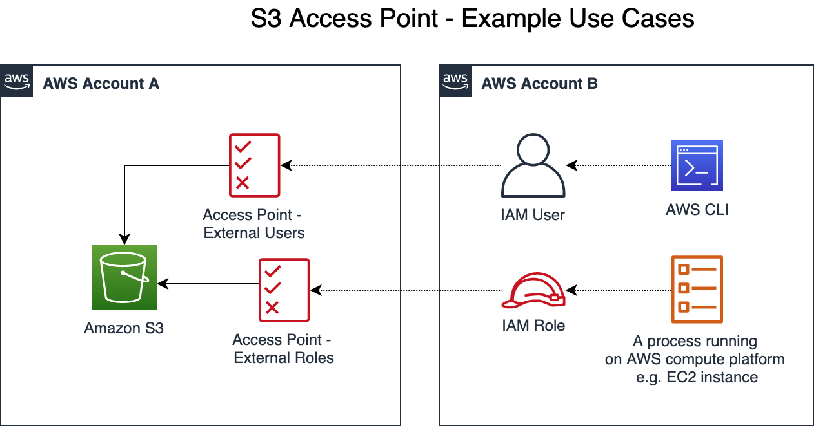

# Amazon S3 Cross-account Access using Access Points

This is a sample solution to demonstrate S3 cross-account access using [Access points](https://docs.aws.amazon.com/AmazonS3/latest/dev/access-points.html). It demonstrate two examples as  shown in the below figure.



## Build Instructions

1. The source code has Maven nature, so if you have Maven locally then you can build it using standard Maven commands e.g. ```mvn -X clean install```. or use the options available in your IDE
2. This will generate a jar file called ```s3-cross-account-access-points-0.1.jar```

## AWS Service Requirements

The following AWS services are required to demo/try this solution.

### Source Account

1. One S3 Bucket
1. One Bucket Policy
1. Two Access Points
1. One KMS Key to encrypt S3 bucket

```Note:``` KMS Key is optional, if you want to skip this, skip all steps related to KMS Key in the subsequent sections.

### Target Account

1. One IAM Group
1. One IAM User
1. One IAM Role
1. One EC2 Instance

## Utility Classes Overview

| Class | Overview|
|-------------------------------------------------------------- | -------------- |
| [PutObject_Demo_UsingIAMRole](./src/main/java/com/amazonaws/s3/accesspoints/PutObject_Demo_UsingIAMRole.java) | Java class to upload an object to S3 - to be executed on an EC2 instance.|
| [PutObject_Demo_StandaloneUser](./src/main/java/com/amazonaws/s3/accesspoints/PutObject_Demo_StandaloneUser.java) | Java class to upload an object to S3 - to be executed on your Laptop / MacBook.|

## Deployment Instructions - Account B

1. Login to AWS Console and go to IAM
1. Create an IAM User Group  with the following IAM Policies
   - [user_group_kms_policy_sample](./src/main/resources/user_group_kms_policy_sample.json)
   - [user_group_s3_policy_sample](./src/main/resources/user_group_s3_policy_sample.json)
1. Create an IAM User and add it to the  group created in  Step # 2
1. Create an IAM Role with two policies as follows:
   - IAM Policy for S3. Use [s3_policy_iam_role_ec2_instance](./src/main/resources/s3_policy_iam_role_ec2_instance.json) as a sample
   - IAM Policy for KMS. Use [kms_key_policy](./src/main/resources/kms_key_policy.json) as a sample
1. Provision as EC2 Instance with the following settings
   - t2.micro instance should be good enough
   - the IAM Role created in Steps # 4
   - Make sure the security allows inbound access only from your IP address
   - Make a note of the public IP address

## Deployment Instructions - Account A (E.g. 2345678901)

1. Logon to AWS Console
1. Go to KMS and create a Customer managed key
   - For Key administrators, add required users / roles in Account A
   - For Key users, add
      - required users / roles in Account A
      - under ```Other AWS accounts```, add id for Account B e.g. ```arn:aws:iam::123456790:root```
1. Go to S3 and create a bucket
1. Go to Properties, under Default encryption, select AWS-KMS and select the KMS key created in the previous step
1. Create a bucket policy using sample [bucket_policy_delegate_permissions_to_access_point](./src/main/resources/bucket_policy_delegate_permissions_to_access_point.json)
1. Create first access point using sample [access_point_for_external_roles_sample](./src/main/resources/access_point_for_external_roles_sample.json)
1. Create second access point using samples [access_point_for_external_users_sample](./src/main/resources/access_point_for_external_users_sample.json)

## Testing Instructions - Account B (E.g. 123456790)

1. **Pre-requisite:** [AWS CLI v2](https://docs.aws.amazon.com/cli/latest/userguide/install-cliv2.html) is required on your on your Laptop / MacBook
1. **Test # 1** - using AWS CLI v2 on your Laptop / MacBook

   ```bash
   aws s3api put-object --bucket arn:aws:s3:us-east-1:2345678901:accesspoint/access-point-external-users --key <Object_Name> --body <Object_Path> --profile default
   ```

1. **Test # 2** - using EC2 instance

   1. Logon to EC2 Instance using the command below

      ```ssh -i my_ec2_keypair.pem ec2-user@Public_IP_of_EC2```

   1. Install Open JDK v 1.8
   1. Logout from EC2 Instance
   1. Upload Jar file to EC2 instance

      ```bash
      scp -i /Users/<Your_User_Id>/Downloads/my_ec2_keypair.pem s3-cross-account-access-points-0.1.jar ec2-user@<Public_IP_of_EC2>:/home/ec2-user/
      ```

   1. Logon to EC2 Instance

   1. Run the Java Program

      ```bash
      java -jar s3-cross-account-access-points-0.1.jar arn:aws:s3:us-east-1:2345678901:accesspoint/access-point-external-roles from_ec2_instance us-east-1
      ```

## License Summary

This sample code is made available under the MIT license. See the LICENSE file.